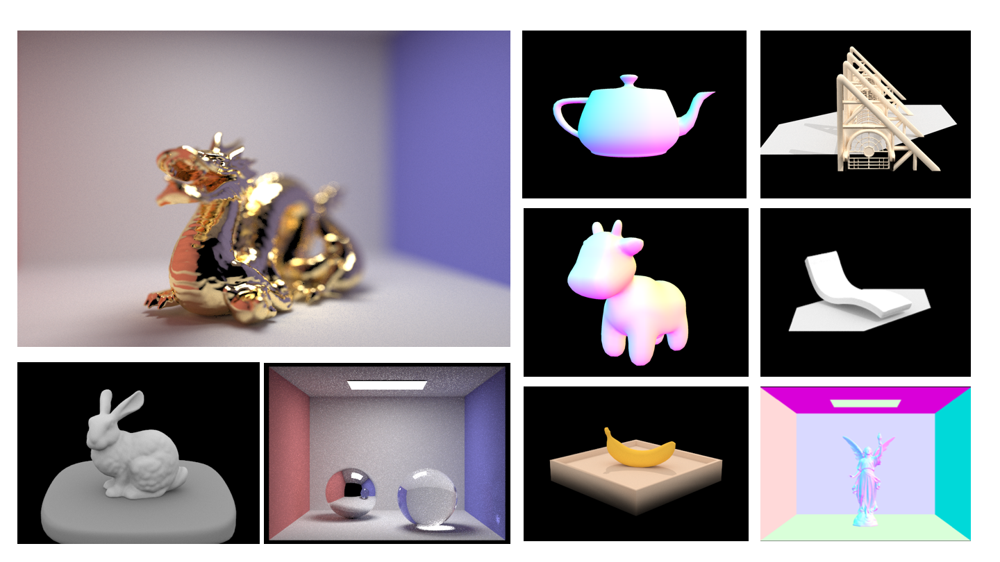
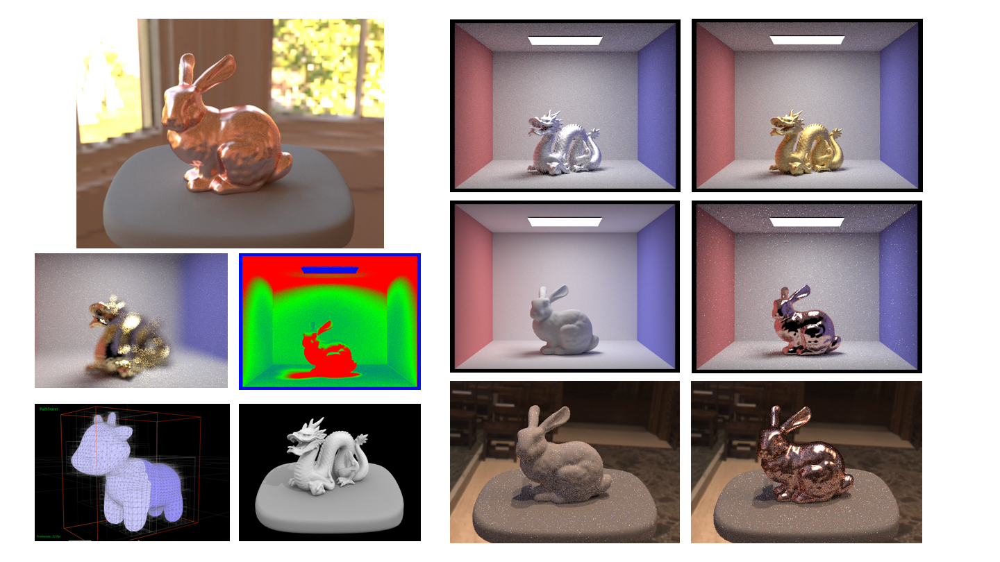

# Graphic-Renderer

[](https://travis-ci.com/Gan-Tu/Graphic-Renderer)

A fully functional, accelerated physically-based renderer using the pathtracing algorithm.


## Code Protection

Upon request of the course staff, the source code will not be shown publicly on GitHub. The source code is currently password protected, zipped in `src.zip`. To request for the password for unzipping the source file, send me an email.

## Write-Up
You can read my detailed [writeup](https://gan-tu.github.io/Graphic-Renderer/) to understand what features I have implemented, how I developed them, see many of the cool results, and view side-by-side comparisons of the performance by different techniques.

## Glimpse of Results





## Using the Program in Command Line

Use these flags between the executable name and the dae file when you invoke the program. 


Flag and parameters | Description
----- | ------
-s \<INT\>  |  Number of camera rays per pixel (default=1, should be a power of 2)
-l \<INT\>  |  Number of samples per area light (default=1)
-t \<INT\>  |  Number of render threads (default=1)
-m \<INT\>  |  Maximum ray depth (default=1)
-f \<FILENAME\>  | Image (.png) file to save output to in windowless mode
-r \<INT\> \<INT\> | Width and height in pixels of output image (if windowless) or of GUI window
-p \<x\> \<y\> \<dx\> \<dy\>  |  Used with the -f flag to render a cell
-c \<FILENAME\> |  Load camera settings file (mainly to set camera position when windowless)
-a \<INT\> \<FLOAT\>   | Samples per batch and tolerance for adaptive sampling
-H | Enable hemisphere sampling for direct lighting
-h | Print command line help message
-e | some_map.exr loads an environment light .exr image file 
-b \<FLOAT\> | sets the lens radius
-d \<FLOAT\> | sets the focal distance


## Using the GUI

#### Moving the camera (in edit and BVH mode)

Command | Action
---- | ----
Rotate |  Left-click and drag
Translate  |  Right-click and drag
Zoom in and out | Scroll
Reset view  | Spacebar

#### Keyboard commands

Command  |Keys
---- | ----
Mesh-edit mode (default)   |  E
BVH visualizer mode  |V
Descend to left/right child (BVH viz)   | LEFT/RIGHT
Move up to parent node (BVH viz)   |  UP
Start rendering  |R
Save a screenshot   | S
Decrease/increase area light samples    | - +
Decrease/increase camera rays per pixel  |[ ]
Decrease/increase maximum ray depth | < >
Toggle cell render mode | C
Toggle uniform hemisphere sampling |  H
Dump camera settings to file   |  D
Increase/Decrease the camera lens radius | k  l
Increase/Decrease the focal distance | ;  '

Cell render mode lets you use your mouse to highlight a region of interest so that you can see quick results in that area when fiddling with per pixel ray count, per light ray count, or ray depth.


## Example Commands

For example, to simply run the regular GUI with the `CBspheres.dae` file and 8 threads, you could type:

```
./pathtracer -t 8 ../dae/sky/CBspheres_lambertian.dae
```

And hit R to render.

If you wanted to save to the `spheres_64_16_6.png` file on the machine with 64 samples per pixel, 16 samples per light, 6 bounce ray depth, and 480x360 resolution, you might rather use something like this:

```
./pathtracer -t 8 -s 16 -l 4 -m 6 -r 480 360 -f spheres_16_4_6.png ../dae/sky/CBspheres_lambertian.dae
```

**Uniform hemisphere sampling**

Lower Resolution

```
./pathtracer -t 8 -s 16 -l 8 -m 6 -H -f CBbunny_16_8.png -r 480 480 ../dae/sky/CBbunny.dae
```

Higher Resolution

```
./pathtracer -t 8 -s 64 -l 32 -m 6 -H -f CBbunny_64_32.png -r 480 360 ../dae/sky/CBbunny.dae
```
**Importance sampling by sampling over lights**

```
./pathtracer -t 8 -s 64 -l 32 -m 6  -f dragon_64_32.png -r 480 480 ../dae/sky/dragon.dae
```

```
./pathtracer -t 8 -s 64 -l 32 -m 6  -f bunny_64_32.png -r 480 360 ../dae/sky/CBbunny.dae
```

**Global Illumination**

```
./pathtracer -t 8 -s 64 -l 16 -m 5 -r 480 360 -f spheres.png ../dae/sky/CBspheres_lambertian.dae
```

**Adaptive Sampling**

Samples per batch and tolerance for adaptive sampling: `-a <INT> <FLOAT>`

```
./pathtracer -t 8 -s 2048 -a 64 0.05 -l 1 -m 5 -r 480 360 -f bunny.png ../dae/sky/CBbunny.dae
```

**Environment Map**

```
./pathtracer -t 8 -e ../exr/grace.exr ../dae/sky/bunny_unlit.dae
```


## Build System

If you don't have [CMake](https://cmake.org) (version >= 2.8) on your personal computer, you can install it using `apt-get` on Linux or `Macports/Homebrew` on OS X. Alternatively, you can download it directly from the CMake website.

To build the code, start in the folder that GitHub made or that was created when you unzipped the download. 

Run
```
mkdir build; cd build
```

to create a build directory and enter it, then

```
cmake ..
```

to have CMake generate the appropriate Makefiles for your system, then

```
make 
```

to make the executable, which will be deposited in the build directory.
